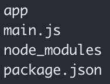

# Getting Started Guide

This is a guide on how to get started modding CmSpeedrunner's game Pixel Railfight
This will explain how to change aspects of the game without the need for an external editor

***This file is obsolete because if you downloaded this repo, it will already be set up like this***

You will need:
- A terminal app such as PowerShell, iTerm, or Terminal
- NPM (Node Package Manager. You may also need [Node JS](https://nodejs.org/en/))
- The `.asar` file from the game
- And a little JavaScript knowledge

## Getting Started

First, download [Pixel Railfight](https://cmspeedrunner.itch.io/pixel-railfight).
You will need the `.asar` file, which contains all of the game's assets and code

On Windows, use the second download (Pixel Railfight ZIP)
It will download a `.zip` file. Unarchive it, and the `.asar` is located in `/resources/app.asar`

On MacOS, two finger click the Pixel Railfight app and select "Show Package Contents".
The `.asar` would be located in `/Contents/Resource/app.asar`

I'm not a Linux user, so I don't know for certain, but there may be a way to unarchive the `.AppImage` file.
The `.asar` will probably be located in `/resources/app.asar`

Unarchiving the ASAR File
---------
Next you need to is install NPM
As for NPM, open up terminal and enter `curl -qL https://www.npmjs.com/install.sh | sh`

***TIP:
     Run "npm -help" to make sure it is installed***

After installing npm, you will need to install a program to unarchive the .asar file.
This is simple enough because you can install one using npm by running this in the terminal: `npm install -g asar`

Then, through terminal, locate the `app.asar` file, and unarchive it by running `asar extract app.asar .`

On MacOS I recommend copying `app.asar` to a separate folder, instead of unarchiving it in the one it is found in

Assuming everything was done correctly, the current folder should contain these files:

Compiling the Data
-----------
We are going to need to be able to compile everything once we make changes to the code, therefore you need to install electron:
1. Remove the default electron folder (`rm -r node_modules/@electron`)
2. Install electron & electron-packager (`npm install electron-packager --save-dev && npm install --save-dev electron`)
3. NPM may ask you to fix some "vulnerabilities", but most of the time this is unimportant

We will use electron-packager to compile all the data and spit out an executable:

If you are on Windows, run (in the terminal):
`electron-packager . electron-tutorial-app --overwrite\
 --asar=true\
 --platform=win32 --arch=ia32\
 --prune=true --out=release-builds\
 --version-string.CompanyName=CE --version-string.FileDescription=CE --version-string.ProductName="Pixel Railfight Mod"`

On MacOS (also in the terminal):
`electron-packager . --overwrite --platform=darwin --arch=x64 --prune=true --out=release-builds`

On Linux (again, in the terminal):
`electron-packager . pixel-railfight-mod --overwrite --asar=true --platform=linux --arch=x64 --prune=true --out=release-builds`

More info about electron-packager can be found [here](https://www.christianengvall.se/electron-packager-tutorial/)

***NOTE:
     If you get an error complaining about your architect/arch, replace the x64 in --arch=x64 or the "ia32" in --arch=ia32 with your computer's architecture***

The executable should be located in the new folder titled `release-builds`

Conclusion
-----
And thats all you need to get started! The next guide (`Modding.md`), I will show how you'd actually mod the game!
Thanks for reading!

Written by Relic374 (Mon Jul 11 2022)
